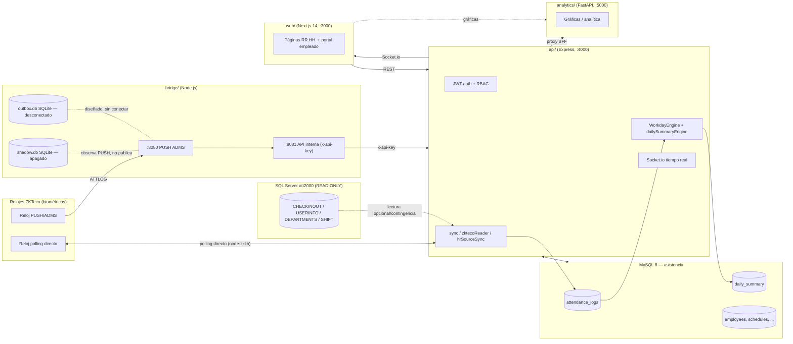

# SisHoras (Gestion_Horas) — Documentación completa del proyecto

> Generado por auditoría de solo lectura del repositorio `Gestion_Horas`
> (owner `DaltonP93`). Baseline verificado: rama `main`, commit
> `2f81983` (equivalente funcional a `53fee69`, HEAD documentado en
> `docs/AI_HANDOFF.md` al 2026-09-01; el único commit posterior en `main`
> toca sólo `.github/workflows/ci.yml`). Fecha de esta auditoría: 2026-09-03.
>
> Este documento no afirma cumplimiento legal/laboral de ningún cálculo.
> Donde el código no permite confirmar un comportamiento con certeza, se
> indica explícitamente como "no verificado" o "pendiente".

## Índice

1. [Visión general del producto](#1-visión-general-del-producto)
2. [Arquitectura](#2-arquitectura)
3. [Módulos funcionales](#3-módulos-funcionales)
4. [Modelo de datos y migraciones](#4-modelo-de-datos-y-migraciones)
5. [Seguridad y reglas no negociables](#5-seguridad-y-reglas-no-negociables)
6. [Configuración por entorno](#6-configuración-por-entorno)
7. [Flags de escritura fail-closed](#7-flags-de-escritura-fail-closed)
8. [CI/CD y testing](#8-cicd-y-testing)
9. [Estado del desarrollo — FASES E / F / F+ y backlog Draft](#9-estado-del-desarrollo--fases-e--f--f-y-backlog-draft)
10. [Glosario y referencias](#10-glosario-y-referencias)

---

## 1. Visión general del producto

**SisHoras** (nombre de repositorio: `Gestion_Horas`) es el reemplazo web
moderno de un sistema legado de control de asistencia basado en relojes
biométricos **ZKTeco** y una base de datos SQL Server llamada **att2000**
(producto "ZKTeco Fingerprint Attendance System V2011").

Objetivo funcional: leer marcaciones de los relojes (por PUSH/ADMS o por
polling directo), calcular asistencia por empleado/día/semana/mes, y ofrecer
un panel administrativo de RR.HH. con:

- gestión de empleados, turnos, permisos, vacaciones, horas extra;
- reportes operativos y legales (Paraguay: MTESS, IPS, aguinaldo);
- portal de autogestión del empleado (marcación móvil, permisos, vacaciones);
- analítica (gráficas por empleado) y auditoría de accesos/cambios.

La fuente **att2000 es estrictamente de solo lectura**: el sistema puede leer
marcaciones y catálogos de allí (contingencia, migración, recuperación
histórica), pero **nunca escribe** en esa base. Este principio aparece
repetido y verificado por tests en varios puntos del código y la
documentación (`docs/att2000-legacy.md`, `docs/runbook.md`,
`api/tests/att2000Readonly.test.js` según `CLAUDE.md`).

El desarrollo del producto muestra dos frentes claramente diferenciados a la
fecha de esta auditoría:

- **Lo que está en `main`** (fusionado, con CI verde): el sistema operativo
  completo v1.0.0 (lectura ZKTeco, asistencia, turnos, permisos, vacaciones,
  horas extra, reportes/legal, portal de empleado, más de 20 módulos
  adicionales — ver sección 3) y el motor de jornada (`WorkdayEngine`)
  integrado sólo en modo lectura/reporte.
- **Lo que está en ramas `claude/*` sin mergear** (más de 30 ramas, detrás de
  ~24 Pull Requests en estado Draft, numerados aproximadamente #158–#190,
  pendientes de auditoría): un programa FASE F de gobierno organizacional,
  personas/candidatos, calendario laboral versionado y una base de nómina en
  sandbox, más su capa de UI (FASE F+), herramientas de solo lectura para el
  rollout de FASE E, y una serie de completados de módulos menores (exports
  CSV, decisión en lote de horas extra, edición de cursos) y correcciones de
  auditoría/PII. Ver sección 9 para el detalle completo.

## 2. Arquitectura

### 2.1 Componentes

| Componente | Tecnología | Puerto | Responsabilidad |
|---|---|---|---|
| `api/` | Node.js + Express, Sequelize (MySQL), JWT, Socket.io | 4000 | API REST, autenticación, tiempo real, orquesta sync/reportes |
| `web/` | Next.js 14 (App Router), Tailwind CSS, Recharts | 3000 | Interfaz administrativa y portal de empleado |
| `analytics/` | Python 3.12, FastAPI | 5000 (sólo loopback; consumida vía API como BFF) | Analítica/reportes (gráficas) |
| `bridge/` | Node.js | 8080 (PUSH ADMS de relojes) / 8081 (API interna del bridge) | Recepción/consulta de marcaciones ZKTeco |
| MySQL 8 | — | 3306 (loopback en producción) | Base propia `asistencia` |
| SQL Server `att2000` | — | 1433 | Fuente externa **read-only** del sistema legado ZKTeco |
| Redis | — | 6379 (loopback + password) | Cache, pub/sub tiempo real, locks distribuidos, colas |
| PM2 | — | — | Gestor de procesos en producción (api, web, bridge, analytics, sync-worker) |
| Nginx | — | 80/443 | Reverse proxy (según `docker-compose.yml` / `PRODUCCION.md`) |

### 2.2 Diagrama

### 2.3 Flujo principal de datos

1. Los relojes emiten marcaciones por **PUSH/ADMS** (recomendado, tiempo
   real) al Bridge en el puerto 8080, o el Bridge las obtiene por
   **polling directo** (`node-zklib`) contra el reloj.
2. El Bridge normaliza y publica hacia el API (Redis pub/sub + persistencia
   en MySQL vía la API), y expone estado (`/push-state`, `/push-metrics`)
   protegido con `x-api-key` en el puerto 8081.
3. La API guarda las marcaciones en `attendance_logs` y calcula
   `daily_summary` (ver sección 4.3).
4. `att2000` es una vía **alternativa y opcional** de ingesta (contingencia,
   migración histórica), detrás de un kill switch (`ATT2000_AUTO_PULL_ENABLED`,
   default `false`) — ver sección 7.
5. El motor `WorkdayEngine` (sección 3.x, 9) procesa los `attendance_logs`
   para reportes (Marcadas); su integración con la escritura de
   `daily_summary` existe pero está **detrás de flags apagados**.
6. `analytics/` (FastAPI) sirve gráficas; según `PRODUCCION.md` sólo escucha
   en loopback y se consume a través de la API como Backend-for-Frontend.

## 3. Módulos funcionales

`CLAUDE.md` documenta un subconjunto de páginas. El código real en
`web/src/app/(app)/` (rama `main`) tiene **muchas más** páginas que las
listadas allí — la lista de `CLAUDE.md` está desactualizada respecto del
código. A continuación se documentan todos los módulos encontrados,
agrupados; se marca cuáles no aparecen en `CLAUDE.md`.

### 3.1 Módulos documentados en `CLAUDE.md` (confirmados en código)

| Página | Propósito | Endpoints API asociados (routes/) |
|---|---|---|
| `/login` | Autenticación JWT | `auth.js` |
| `/dashboard` | KPIs en tiempo real vía Socket.io | `attendance.js`, socket namespace |
| `/asistencia` | Tabla diaria con feed en vivo, marcaje manual | `attendance.js` |
| `/empleados`, `/empleados/[id]`, `/empleados/nuevo` | CRUD de empleados, ficha con historial | `employees.js`, `employeeDocuments.js`, `employeeNotes.js` |
| `/permisos` | Aprobación/rechazo de permisos (incluye rechazo con fecha alternativa en vacaciones) | `permissions.js`, `approvalRules.js`, `approvalsSla.js` |
| `/reportes`, `/reportes/planillas-legales`, `/reportes/personalizado` | Marcadas (PDF estilo ZKTeco), reportes programados, SMTP, MTESS/IPS/aguinaldo | `reports.js`, `legal.js`, `legalData.js`, `reportsBuilder.js` |
| `/turnera` | Planificación de turnos (semana domingo→sábado) | `shifts.js` |
| `/horas-extra` | Revisión/autorización de horas extra | `overtime.js` |
| `/marcaciones-fuera-rango` | Entradas/salidas fuera de umbral configurable | `attendance.js` / `rules.js` |
| `/marcaciones-geocerca` | Marcajes fuera del perímetro de sede (modo "advertir") | `attendance.js`, `geofence` (service) |
| `/vacaciones` | Plan mensual, saldos, política por antigüedad | `vacations.js`, `vacationBalance` (service), `antiguedad` (service) |
| `/ingresos` | Contratos, período de prueba, alertas, baja de personal | `contracts.js` |
| `/lactancia` | Maternidad/lactancia con vigencia y alertas | `lactancia.js` |
| `/onboarding` | Checklists de ingreso/egreso | `onboarding.js` |
| `/marcar` | Marcación móvil con validación de geocerca | `selfCheckin.js`, `geofence` |
| `/configuracion/reglas` | Constructor de condiciones (motor de reglas parametrizable) | `rules.js`, `ruleEngine`/`ruleRuntime` (services) |
| `/configuracion/sedes` | Sedes + geocerca (coordenadas/radio, modo global) | `branches.js` |
| `/usuarios`, `/usuarios/[id]` | CRUD usuarios con roles | `users.js` |
| `/analytics/[id]` | Gráficas por empleado (Recharts) | `analytics.js` (proxy hacia FastAPI) |
| `/configuracion` | Configuración general (branding, tema, firma, empleador) | `settings.js` (ver `docs/settings-endpoints.md`, sección 5) |

Ayuda contextual: botón flotante "?" (`HelpButton`) que muestra documentación
de cada módulo desde `web/src/data/helpContent.ts` (1193 líneas — cubre buena
parte, no necesariamente todos, de los módulos listados abajo).

### 3.2 Módulos presentes en el código pero **no** listados en `CLAUDE.md`

Confirmado en `web/src/app/(app)/` sobre `main` (no en ramas Draft):

| Página | Propósito aparente (por nombre/ruta y rutas API relacionadas) |
|---|---|
| `/aprobaciones` | Bandeja de aprobaciones (probable consolidado de `approvalRules`/`approvalsSla`) |
| `/auditoria` | Vista de `audit_events` (`audit.js`) |
| `/banco-horas` | Banco de horas / compensatorio (`overtimeBank.js`) |
| `/calendario` | Calendario (feriados / turnos combinados; distinto del "calendario laboral" de FASE F3, aún no mergeado) |
| `/capacitaciones` | Cursos (`courses.js`) — completado con edición en rama Draft (sección 9) |
| `/comunicados` | Anuncios (`announcements.js`) |
| `/departamentos` | CRUD de departamentos con jerarquía (`departments.js`, migración 066) |
| `/ejecutivo` | Panel ejecutivo (`executive.js`) |
| `/encuestas` | Encuestas de pulso (`surveys.js`) |
| `/evaluaciones` | Evaluaciones de desempeño (`appraisals.js`) |
| `/nomina` | Módulo de nómina existente en `main` (payroll básico, `payroll.js`, `paymentTypes.js`) — **distinto** del sandbox de nómina FASE F4 aún no mergeado |
| `/supervisor` | Vista para supervisores (`supervisor.js`) |
| `/cuenta`, `/cuenta/perfil`, `/cuenta/preferencias`, `/cuenta/seguridad` | Perfil/seguridad de la cuenta propia (2FA, sesiones activas) |
| `/mi-asistencia`, `/mis-permisos`, `/mis-vacaciones`, `/mis-documentos`, `/mi-perfil` | Portal de autogestión del empleado |
| `/sistema/backups`, `/sistema/embed`, `/sistema/gdpr`, `/sistema/legado-att2000`, `/sistema/procesar`, `/sistema/salud` | Panel de sistema: backups, tokens de embed, GDPR/anonimización, panel att2000 legado, procesamiento en lote, salud (`/api/health`) |
| `/configuracion/apariencia`, `/discovery`, `/feriados`, `/firma`, `/integraciones-hr`, `/metas`, `/plantillas-email`, `/qr-asistencia`, `/reglas-permisos`, `/sincronizacion`, `/turnos`, `/webhooks` | Sub-secciones de configuración: tema visual, descubrimiento de relojes en red, feriados (Paraguay), firma para reportes, integraciones HR externas (`hrSources.js`), metas KPI (`kpiGoals.js`), plantillas de email, QR de asistencia, reglas de aprobación de permisos, sincronización, catálogo de turnos, webhooks salientes |
| `/kiosk/[branchId]` | Modo kiosco por sede (marcación compartida) |
| `/m/[group]` | Rutas móviles agrupadas (probable layout simplificado para el portal empleado) |
| `/embed/[token]` | Vistas embebibles vía token (`embedTokens`, migración 031) |

> **Nota de honestidad documental:** el propósito exacto de cada una de estas
> páginas no se verificó línea por línea del código de UI (fuera del alcance
> de tiempo de esta auditoría); se infiere de nombre de ruta + módulo API
> asociado. Se recomienda que quien audite el negocio confirme cada uno
> contra `web/src/app/(app)/<módulo>/page.tsx` y su ruta API antes de
> tratarlo como documentación funcional definitiva.

### 3.3 RBAC — roles y permisos

- Roles observados en `authorize(...)` a través de `api/src/routes/*.js`:
  `super_admin`, `admin`, `gth`, `hr`, `gestor`, `manager`, `coordinator`,
  `supervisor`, `employee`. El ENUM original de `database/init.sql` sólo
  define `admin`, `hr`, `supervisor`, `employee`; los roles adicionales
  (`gestor`, `super_admin`, etc.) se agregaron vía migraciones posteriores
  (`003_gestor_role.sql`, `010_super_admin_role.sql`).
- `super_admin` tiene **bypass implícito** de `authorize()` (siempre pasa).
- `requireSuperAdmin` es una restricción **estricta sin bypass** (ni `admin`
  ni `gth` entran) — usada para relojes, BD, sync, módulo sistema.
- Además de `authorize(rol...)` existe `requirePermission(recurso, acción)`
  (permisos granulares por matriz, `services/permissionMatrix.js`),
  usado en endpoints sensibles (ej. `/api/settings/admin`, ver
  `docs/settings-endpoints.md`).
- `authenticateServiceKey` valida la cabecera `x-api-key` contra
  `BRIDGE_API_KEY` para la comunicación bridge→API.
- El middleware `authenticate` acepta el JWT por header `Authorization:
  Bearer` o, sólo en `GET`, por query `?access_token=` (para descargas vía
  `<a href>`/`window.open`, que no permiten headers custom).

## 4. Modelo de datos y migraciones

### 4.1 Baseline vs. migraciones

`database/init.sql` es un **baseline deliberadamente parcial**: sólo declara
10 tablas fundacionales (`attendance_logs`, `daily_summary`, `departments`,
`devices`, `employees`, `holidays`, `permissions`, `refresh_tokens`,
`schedules`, `users`). El resto del esquema — **55 tablas adicionales**
declaradas a través de 73 archivos de migración numerados (`002` a `075` en
`main`) — se construye incrementalmente con el runner
`api/scripts/migrate.js` (`npm run migrate` / `migrate:status`).

Esto generó al menos un incidente de "deriva de esquema" documentado en
`docs/hr-sources-schema.md`: una base de producción adoptó el runner con
`--baseline=<archivo posterior a la migración 007>`, lo que marcó `007`
(`external_hr_sources`) como aplicada sin haberse ejecutado nunca — la tabla
no existía en producción aunque `schema_migrations` decía que sí. El detector
de esta clase de deriva es de sólo lectura: `cd api && npm run schema:drift`
(compara `init.sql` + migraciones contra `information_schema`).

### 4.2 Tablas principales por área (no exhaustivo — ver los 73 archivos en
`database/migrations/` para el detalle línea a línea)

| Área | Tablas clave | Migración de origen |
|---|---|---|
| Identidad/auth | `users`, `refresh_tokens`, migración 013 (2FA + reset password) | init.sql, 013 |
| Empleados | `employees`, `employee_documents` (067), `employee_pay_type`/`paymentTypes` (043, 068), `job_titles` (069), inactivación (063) | init.sql, varias |
| Asistencia cruda | `attendance_logs` (con `UNIQUE`, migración 005), `raw_device_punches` (056), `device_sync_runs` (057/059/060/065/070) | init.sql, 005, 056–070 |
| Resumen diario | `daily_summary`, ENUM `status` ampliado con `unknown` (074, no ejecutada en prod) | init.sql, 074 |
| Turnos/Turnera | `schedules`, `shift_schedules`/`shift_assignments` (042), `schedule_break_minutes` (047) | init.sql, 042, 047 |
| Configuración laboral por vigencia (FASE C) | `employee_schedule_history` (072), perfil/overlap guard (073) | 072, 073 |
| Permisos/vacaciones | `permissions`, tipos (004), workflow (011), adjuntos (014), SLA (024), vacaciones parametrizables (050) | init.sql, 004, 011, 014, 024, 050 |
| Contratos/egresos | `employee_contracts` (051) | 051 |
| Maternidad/lactancia | migración 052 | 052 |
| Geocerca | migración 053, unificación de columnas geo (040) | 040, 053 |
| Legal Paraguay | planillas MTESS/IPS (041), feriados PY (045), aguinaldo/liquidación (044), semana domingo-primero (046) | 041, 044, 045, 046 |
| Reglas de negocio | `condition_rules` (049) | 049 |
| Dispositivos ZKTeco | parámetros de conexión (008), sensor id (009), auto-sync (061), locks/jobs (064) | 008, 009, 061, 064 |
| Sincronización HR externa | `external_hr_sources` (007, reparada en 071) | 007, 071 |
| Auditoría | `audit_events` (012), full-text (033) | 012, 033 |
| Notificaciones | `notifications`, `user_notifications` (017), horarios (002) | 002, 017 |
| Otros módulos RR.HH. | anuncios (027), cursos (028), encuestas de pulso (029), plantillas de email (030), embed tokens (031), reconocimiento facial (032), evaluaciones/appraisals (034), onboarding (035), banco de horas (026) | 026–035 |
| Departamentos | jerarquía (066) | 066 |
| Sucursales | `branches` (015) | 015 |
| GDPR | anonimización (025) | 025 |
| Sesiones/perfil de cuenta | 062 | 062 |

### 4.3 Flujo att2000 → asistencia (según `CLAUDE.md` y confirmado en código)

1. La API lee `att2000.CHECKINOUT` (`USERID`, `CHECKTIME`, `CHECKTYPE` I/O) —
   sólo por endpoints manuales bajo `/api/sync` o, si el kill switch
   `ATT2000_AUTO_PULL_ENABLED=true` está encendido, por un cron opcional.
2. Mapea `USERID` → `employees.code` (o `employee_device_map` para el
   camino directo de relojes).
3. Inserta en `attendance_logs` con `type` `in`/`out`.
4. Calcula `daily_summary` (worked_minutes, late_minutes, status) — hoy por
   el camino **legacy** (`legacyRecalcDailySummary` /
   `legacyBulkRecalcDailySummary`); el camino nuevo por `WorkdayEngine` +
   `dailySummaryEngine` existe y está probado, pero permanece detrás del
   flag `WORKDAY_ENGINE_DAILY_SUMMARY_WRITE_ENABLED` (default apagado, ver
   sección 7).

El **motor de jornada** (`api/src/services/workdayEngine.js` +
`dailySummaryEngine.js`, documentado extensamente en `docs/motor-jornada.md`)
corrige defectos verificados del cálculo legacy: reinterpretación horaria
del histórico por zona horaria de Paraguay (cambio de DST hasta 2024),
corte fijo arbitrario a las 05:00, emparejamiento posicional de marcajes
(en vez de por `type`), y el bug `24:xx` de `Intl`/ICU dependiente del
entorno. El motor distingue tres totales que **no son sinónimos**:
`presence_minutes` (primera entrada→última salida), `segment_minutes` (suma
de tramos) y `worked_minutes` neto (segment menos descanso) —
`daily_summary.worked_minutes` históricamente guarda `presence_minutes`, y
ese mapeo se conserva de forma explícita para no mover números históricos de
RR.HH. sin decisión de negocio.

El motor opera en dos modos por **fecha** (nunca por empleado):
`historical_fallback` (sin configuración vigente; sólo describe segmentos,
sin atraso/horas-extra) y `configured` (con snapshot histórico completo:
agrega atraso, salida anticipada, jornada esperada y objetivo semanal). Ver
`docs/workday-configuration-model.md` para la precedencia exacta
(Turnera publicada > `employee_schedule_history` > `employee_contracts`
sólo como identidad > nada).

Un script de auditoría de sólo lectura permite contrastar el motor nuevo
contra el legacy sobre datos reales sin escribir nada:
`node scripts/workday-engine-audit.js --from ... --to ...` (clasifica cada
diferencia en `turno_nocturno`, `desfase_horario`, `emparejamiento`, `otro`).

## 5. Seguridad y reglas no negociables

- **att2000 estrictamente read-only.** No existe `writeCheckinOut` ni ningún
  `INSERT/UPDATE/DELETE` sobre `CHECKINOUT` en el conector
  `config/att2000.js`; el viejo flag `ATT2000_WRITE_ENABLED` fue eliminado.
  `att2000Readonly.test.js` (según `CLAUDE.md`) lo verifica sobre el fuente.
- **Nunca fabricar asistencia**: no se inventan entradas, salidas, ausencias
  ni horas trabajadas sin evidencia y trazabilidad; los estados
  `unconfigured`/`non_working` existen precisamente para no convertir "falta
  de configuración" en "ausencia" fabricada (`docs/motor-jornada.md`
  sección 6bis).
- **Los períodos cerrados no se recalculan sin aprobación explícita.**
  `daily_summary` no ha sido recalculado en producción a la fecha de esta
  auditoría; el camino de escritura del motor nuevo existe pero está
  apagado.
- **Ningún dato sensible en el repositorio**: credenciales, hosts, IPs
  internas, biometría, PII de empleados no deben aparecer en commits,
  documentación ni logs. Confirmado: `.env.example` usa placeholders
  (`sqlserver.example.internal`, `<CONFIGURAR_SOLO_EN_API_ENV>`, etc.), sin
  valores reales.
- **Auditoría sin PII en texto libre.** Rama Draft
  `claude/redact-reason-contracts-egreso` corrige que la baja de un empleado
  y el egreso de contrato **no** serializan el nombre (PII) ni el motivo
  (texto libre) en `audit_events` — pendiente de merge a la fecha de esta
  auditoría. Ver también `dc16127` en el histórico FASE F ("la auditoría
  nunca serializa el texto libre `reason`").
- **Modo sombra del Bridge (`BRIDGE_SHADOW_ENABLED`)**: observación pasiva de
  marcaciones PUSH para comparar contra polling; persiste sólo una lista
  cerrada de campos del contrato v1 (nunca nombre, IP de reloj, biometría o
  la línea ATTLOG cruda); apagado por defecto.
- **Outbox del Bridge (`BRIDGE_OUTBOX_ENABLED`)**: cola durable diseñada
  para no perder marcaciones si el core está caído; implementada pero
  **desconectada** del flujo real; no persiste IP ni campos fuera de la
  lista cerrada del contrato v1.
- **`/api/settings` público vs. administrativo**: el endpoint sin
  autenticación (`GET /api/settings`, consumido desde `/login`) expone
  **sólo** una allowlist inmutable de branding/tema; excluye explícitamente
  datos de firma (incluye C.I. del firmante) y del empleador (RUC, IPS,
  MTESS, geocerca, tasas de liquidación). `GET /api/settings/admin` exige
  sesión + rol de administración + `requirePermission('configuracion','view')`.
- **Validación de entorno en `NODE_ENV=production`**: la API exige al
  arrancar `JWT_SECRET` (≥32 caracteres), secretos de BD y claves de
  servicio; si falta alguno, no arranca (según `PRODUCCION.md`).
- **Auditoría del modelo de configuración laboral (FASE C)** genera eventos
  con usuario, empleado, snapshot/id, before/after, motivo — sin secretos.

## 6. Configuración por entorno

Sólo nombres de variables — **nunca valores reales**. Fuente:
`.env.example` (raíz) y `api/.env.example`.

### Base de datos y BD fuente
`DB_HOST`, `DB_PORT`, `DB_NAME`, `DB_USER`, `DB_PASSWORD`, `DB_ROOT_PASSWORD`
`ATT_HOST`, `ATT_PORT`, `ATT_USER`, `ATT_PASSWORD`, `ATT_DATABASE`
(las variables reales de att2000 son `ATT_*`; `ATT2000_*` que aparecían en
documentación antigua no son las reales, salvo los flags específicos de
integración legada listados abajo).

### Autenticación
`JWT_SECRET`, `JWT_REFRESH_SECRET`

### Redis
`REDIS_HOST`, `REDIS_PORT`, `REDIS_PASSWORD` (obligatoria — el arranque
falla sin ella, según `docker-compose.yml`), `REDIS_URL` (alias documentado
en `CLAUDE.md`)

### Correo (SMTP)
`SMTP_HOST`, `SMTP_PORT`, `SMTP_USER`, `SMTP_PASS`, `SMTP_FROM`

### Claves internas entre servicios
`BRIDGE_API_KEY`, `INTEGRATION_API_KEY`, `ANALYTICS_API_KEY`

### URLs
`FRONTEND_URL`, `API_URL`/`NEXT_PUBLIC_API_URL`, `ANALYTICS_URL`/
`NEXT_PUBLIC_ANALYTICS_URL`, `SOCKET_URL`, `SOCKET_ORIGIN`

### ZKTeco / Bridge
`ZKTECO_DEVICES`, `ZKTECO_PORT`, `ZKTECO_POLL_INTERVAL`,
`ZKTECO_AUTO_POLL` (kill switch del auto-polling, default `false`),
`ZKTECO_PUSH_WHITELIST` (vacío = todos los relojes permitidos — asimetría
intencional respecto de la allowlist de sombra),
`BRIDGE_SHADOW_ENABLED`, `BRIDGE_SHADOW_DEVICE_ALLOWLIST` (vacío = ningún
reloj), `BRIDGE_SHADOW_CAPTURE_PUSH`, `BRIDGE_SHADOW_PATH`,
`BRIDGE_PUSH_OBSERVE_ONLY_ALLOWLIST` (vacío = ningún reloj),
`BRIDGE_OUTBOX_ENABLED`, `BRIDGE_OUTBOX_PATH`, `BRIDGE_OUTBOX_CLAIM_TTL_MS`,
`BRIDGE_OUTBOX_MAX_ATTEMPTS`

### Integración att2000 legada (pull automático opcional)
`ATT2000_AUTO_PULL_ENABLED` (default `false`), `ATT2000_PULL_CRON`

### Configuración laboral histórica (FASE C/E)
`WORKDAY_CONFIG_WRITE_ENABLED` (default `false`, fail-closed; sólo el string
exacto `"true"` habilita escritura)

### Motor de jornada / daily_summary (FASE A/B, ver sección 7)
`WORKDAY_ENGINE_DAILY_SUMMARY_WRITE_ENABLED`, `WORKDAY_ENGINE_STATUS_074_ENABLED`

### Redis Streams (durabilidad de marcajes, opcional)
`ATTENDANCE_STREAM_ENABLED` (off por defecto)

### Contrato de marcaciones v1 (aún no conectado)
`PUNCH_CONTRACT_V1_ENABLED` (sin efecto — no hay consumidor todavía)

### Otros
`TZ` (fijo a `America/Asuncion` en el `.env.example` de la API), `NODE_ENV`,
`PORT`

## 7. Flags de escritura fail-closed

Todos con **default seguro (apagado)** salvo indicación contraria. "Fail-closed"
significa que el string exacto `"true"` es la única forma de habilitar la
escritura; cualquier otro valor (ausente, `"1"`, `"TRUE"`, vacío) mantiene el
comportamiento de sólo lectura/legacy.

| Flag | Default | Efecto al activarse |
|---|---|---|
| `WORKDAY_CONFIG_WRITE_ENABLED` | `false` | Habilita crear/corregir/cerrar vigencias históricas de configuración laboral (FASE C). Verificado fail-closed por `api/tests` (mencionados en `docs/workday-engine-rollout-status.md`) y por el kill switch UI (rama `claude/fase-e-*` agrega tests adicionales, no mergeados). |
| `WORKDAY_ENGINE_DAILY_SUMMARY_WRITE_ENABLED` | `false` | Cambia el "dispatcher" de `recalcDailySummary`/`bulkRecalcDailySummary` para que el camino operativo recalcule vía `WorkdayEngine`/`dailySummaryEngine` en lugar del algoritmo legacy congelado. Con OFF, ambos caminos (operativo y en bloque) siguen usando el legacy como rollback (`docs/daily-summary-writers.md`). |
| `WORKDAY_ENGINE_STATUS_074_ENABLED` | `false` (y depende además de que la migración 074 esté aplicada — no lo está en producción) | Permite persistir los estados nuevos `non_working`/`unconfigured` en `daily_summary.status` en vez de colapsarlos a `weekend`/reconciliación por DELETE. Es un flag de **esquema**, independiente del de escritura. |
| `ATT2000_AUTO_PULL_ENABLED` | `false` | Registra el cron de pull automático de marcaciones desde att2000 (sólo si además hay `ATT2000_PULL_CRON`). Con OFF, los endpoints manuales bajo `/api/sync` (restringidos a `super_admin`) siguen operativos igual. |
| `ZKTECO_AUTO_POLL` | `false` | Habilita el worker de auto-polling PM2 (`sishoras-sync-worker`) para relojes en polling directo. |
| `BRIDGE_SHADOW_ENABLED` | `false` | Activa la observación pasiva de marcaciones PUSH en SQLite local del Bridge (no escribe en MySQL/Redis, no interviene el flujo real). |
| `BRIDGE_PUSH_OBSERVE_ONLY_ALLOWLIST` | vacío (ningún reloj) | Por reloj: suprime la publicación de asistencia (Redis/MySQL) de un reloj configurado para PUSH, dejándolo sólo observado por la sombra. Nunca es un interruptor global. |
| `BRIDGE_OUTBOX_ENABLED` | `false` | Activa la cola durable SQLite de reintentos del Bridge; hoy sigue **desconectada** del flujo real aunque se active (nadie la invoca todavía salvo tests). |
| `ATTENDANCE_STREAM_ENABLED` | off (comentado en `.env.example`) | El core consume el stream durable de Redis con consumer-group + ACK, en vez de sólo pub/sub. El bridge siempre escribe al stream; sólo cambia si el *core* lo consume. |
| `PUNCH_CONTRACT_V1_ENABLED` | sin uso | Reservado; el contrato v1 (`contracts/punchContractV1.js`) está definido y testeado pero **no conectado** a ninguna ruta, Redis ni MySQL. |

Gates operativos adicionales (no son variables de entorno, sino condiciones
de proceso documentadas en `docs/workday-engine-rollout-status.md`): no
ejecutar `npm run migrate` a ciegas en producción; no recalcular
`daily_summary` de producción; no continuar la reparación histórica de
febrero-2025 en adelante hasta cerrar el baseline/auditoría de FASE E.

## 8. CI/CD y testing

Workflow único `.github/workflows/ci.yml` (`name: CI`), disparado en push y
pull_request contra `main` y contra ramas/PRs `claude/**` (este último
alcance fue agregado por el commit más reciente de `main`,
`2f81983 ci: disparar CI también en ramas y PRs claude/** (no sólo main)`).

Tres jobs, todos sobre `ubuntu-latest`, Node 20 (`actions/setup-node@v7`,
`actions/checkout@v7`):

| Job | Working dir | Pasos |
|---|---|---|
| `bridge-tests` (Bridge — tests) | `bridge/` | `npm ci \|\| npm install`; tests unitarios corridos **tres veces**, una por cada `TZ`: `UTC`, `America/Asuncion`, `Asia/Tokyo` |
| `api-build` (API — install + syntax) | `api/` | `npm ci`; `node --check src/index.js` (chequeo de sintaxis); tests unitarios en las mismas tres zonas horarias |
| `web-build` (Web — build Next.js) | `web/` | `npm ci`; `npm test`; `npm run build` con `NEXT_TELEMETRY_DISABLED=1` |

La **matriz de tres zonas horarias** (UTC, America/Asuncion, Asia/Tokyo) no
es decorativa: el Bridge convierte hora de pared del reloj a instantes
absolutos, así que la zona del proceso es una entrada real del cálculo — un
runner en UTC no ejerce ni el caso de producción (Paraguay, UTC-4/-3 según
época) ni el caso del lado opuesto del meridiano donde la fecha local ya
cambió.

**No hay, en el `ci.yml` de `main`, un job de migraciones contra una MySQL
efímera.** Ese job existe únicamente en la rama Draft
`claude/fase-f-migrations-072-075-idempotency`
(`ci(fase-f): idempotencia REAL de migraciones 072→075 en MySQL efímero`) —
pendiente de mergear a la fecha de esta auditoría.

Scripts de verificación de sólo lectura disponibles (no forman parte del CI
por defecto; se ejecutan manualmente en el marco del rollout de FASE E):
`schema:drift`, `workday-config-preflight.js`,
`workday-config-impact-audit.js`, `workday-engine-audit.js`,
`daily-summary-dryrun.js`, `benchmark-marcadas-memory.js` (nunca se ejecuta
contra producción salvo manualmente, según `docs/motor-jornada.md`).

## 9. Estado del desarrollo — FASES E / F / F+ y backlog Draft

### 9.1 Confirmado en `main` (fusionado, con CI verde)

Según `docs/workday-engine-rollout-status.md` (actualizado 2026-09-01) y
confirmado por `git log`:

- **FASE A** — `WorkdayEngine`/Marcadas: wall-clock, pairing type-aware,
  cross-midnight, historical_fallback, anomalías, tests golden. Integrada
  sólo en el **reporte** de Marcadas, no en la escritura de `daily_summary`.
- **FASE B** — `daily_summary`/ingesta: `dailySummaryEngine`, writer detrás
  de flag, fail-safe `unknown`, locks/reintentos, att2000 read-only. PR #147
  + follow-up #148 integrados.
- **FASE C** — configuración laboral backend: modelo histórico por
  vigencias (`employee_schedule_history` + perfil), snapshot autosuficiente,
  effective-config, APIs + RBAC + auditoría, preflight/impact-audit de sólo
  lectura, migración 075 aditiva. PR #149 integrado.
- **FASE D** — UI RR.HH. de configuración laboral: índice por empleado,
  consulta efectiva por fecha, historial de vigencias, crear/corregir/cerrar
  snapshot, motivo obligatorio, advertencia retroactiva. PR #150/#151
  integrados (#152 fue un merge redundante que no cambió archivos).
- Merges posteriores, todos en `main`: #153 (runbook post-merge), #154
  (`migrate --status` estrictamente read-only), #155 (kill switch fail-closed
  de escritura de configuración laboral), #156 (este AI handoff), y el commit
  suelto de CI (`2f81983`).
- **Gate activo**: FASE E (auditoría/migraciones/rollout) está **pendiente
  en producción**. Ningún flag de escritura del motor está activado; las
  migraciones 072→075 no están aplicadas en producción; `daily_summary` no
  fue recalculado. Un CI verde y estos merges **no autorizan** por sí solos
  un despliegue, migración o activación de writers.

### 9.2 Backlog Draft sin mergear — confirmado por rama (24+ PRs, aprox. #158–#190)

Todas las ramas siguientes están **por delante de `main`** (confirmado con
`git log main..<rama>`) y **no** fueron mergeadas a la fecha de esta
auditoría. Se agrupan por frente; varias ramas comparten commits porque son
etapas apiladas (stacked) de un mismo desarrollo secuencial.

#### FASE E — herramientas de solo lectura para el rollout (6 ramas)

Construyen el tablero de decisión GO/NO-GO sin tocar datos:

- `claude/fase-e-scripts-readonly-guard`: guarda estático que verifica que
  **todos** los scripts de FASE E son de sólo lectura.
- `claude/fase-e-preflight-partial-gate`: gate de tres estados
  (`GO`/`SAFE_DEGRADED`/`NO_GO_PARTIAL`) en el preflight, para distinguir un
  estado de esquema parcial (072 sin aplicar = degradación segura conocida)
  de un estado intermedio genuinamente peligroso (073 pendiente con 072
  aplicada, o sólo 075 pendiente).
- `claude/fase-e-summary-flags-matrix`: matriz de tests fail-closed de los
  writers de `daily_summary` y de `STATUS_074`.
- `claude/fase-e-drift-checker-fasec`: extiende `schema:drift` para cubrir
  también las dependencias de runtime de FASE C.
- `claude/fase-e-preflight-wrapper-runbook`: wrapper `phase-e:preflight`
  (GO/NO-GO) más runbook con mapa de gates.
- `claude/fase-e-engine-golden-nogo`: casos dorados del motor para las
  categorías NO-GO de enero-2025 (asegura que el preflight detecta
  correctamente los escenarios que deben bloquear el rollout).
- `claude/fase-e-impact-audit-signature`: huella/firma fiel del gate de
  impacto + tests sintéticos; documenta "calidad de asistencia" como
  concepto de auditoría.
- `claude/fase-e-workdayconfig-degradation`: golden test de los 4 estados de
  degradación de `loadWorkdayConfig` ante distintos estados parciales de
  esquema.

#### FASE F1 — Gobierno, organización, permisos granulares y auditoría (1 desarrollo base + 4 fixes)

Rama tope: `claude/fase-f1-gobierno-permisos-auditoria`. Introduce
`companies`/`cost_centers` (migración `076_governance_companies_cost_centers`),
rutas `companies.js`/`costCenters.js`, servicio `governance.js` y
`orgScope.js` (alcance jerárquico: empresa → sucursal → centro de costo).
Iteraciones correctivas registradas en el propio historial de commits
(indicando revisión adversarial, aparentemente por una herramienta o
revisor llamado "Codex" en los mensajes de commit):
- `95cdf9c` — "enforcement de alcance org en API + CI con MySQL real
  (Codex NO-GO)": la primera versión no imponía el alcance organizacional
  del lado del servidor.
- `236778d` — `createCompany`/`createCostCenter` devolvían `id undefined`
  (bug de `insertId` en INSERT crudo — patrón recurrente, ver más abajo).
- `dc16127` — la auditoría no debe serializar el texto libre `reason`.
- `5f97e47` — un rol con alcance (ej. gestor de una sucursal) no debía poder
  crear o dejar huérfano un centro de costo **global**.

#### FASE F2 — Personas: candidatos y asignaciones (stacked sobre F1)

Rama tope: `claude/fase-f2-personas-contratos`. Migración
`078_people_candidates_assignments` (tablas `candidates`,
`employee_assignments`), rutas `candidates.js`/`assignments.js`, servicio
`people.js`. Historial de correcciones:
- `26f05c9` (Codex NO-GO) — conversión candidato→empleado y asignación
  debían ser atómicas; la auditoría no debía filtrar PII; sin `ON DELETE
  CASCADE` involuntario.
- `be83e41`/`a0583ec` (Codex P1-A / P1 v2) — aislamiento real de candidatos y
  asignaciones por alcance organizacional; jerarquía de scope; coherencia
  mutua entre asignación y candidato.
- `186271e` — el guard de orden de vigencias comparaba `Date` con `String`
  en vez de fecha civil (bug de comparación de tipos).
- `42eed10` — la auditoría de `assignment` redacta `change_reason` (texto
  libre) — mismo patrón de higiene de PII que en F1.

#### FASE F3 — Calendario laboral versionado (stacked sobre F1+F2)

Rama tope: `claude/fase-f3-calendario-jornada`. Migración
`079_labor_calendars` (tablas `labor_calendars`, `calendar_exceptions`),
ruta `laborCalendars.js`, servicios `calendarService.js`/`laborCalendar.js`.
Diseñado para **coexistir en modo read-only** con el motor de jornada
existente (FASE A–D), sin reemplazarlo. Correcciones:
- `8637974` (Codex NO-GO) — el primer intento no versionaba de verdad los
  calendarios ni distinguía los tres estados de jornada.
- `14dd0cf`/`8093ee1` (Codex P1-B / P1 v3) — alcance jerárquico real de
  calendarios y control de fechas/esquema de jornada.
- `9063c2c` — un rol con alcance no debía poder crear un calendario
  **GLOBAL**.
- `c6a2a18` — fix de rendimiento: fallback a la empresa por sucursal y
  cálculo de "calendario efectivo" sin patrón N+1.

#### FASE F4 — Base de nómina en sandbox (stacked sobre F1+F2+F3)

Rama tope: `claude/fase-f4-nomina-base`. Migración `080_payroll_base`
(tablas `payroll_concepts`, `payroll_periods`, `payroll_period_snapshots`),
ruta `payrollBase.js`, servicio `payrollBase.js`. Explícitamente **"no
oficial"**: reportes agregados y adaptadores de integración quedan
**siempre apagados** por diseño (no hay flag para encenderlos en este
frente). Endpoints incluyen ciclo de vida de conceptos/períodos, vista
previa, snapshot de cierre y una transición de estado. Correcciones:
- `946a816` (Codex NO-GO) — la transición de período debía ser atómica, con
  un único snapshot, e integraciones siempre apagadas.
- `090b9c3` (Codex P1-C) — la nómina sandbox se restringe a RR.HH. **global**
  (no a un alcance de sucursal/centro de costo).
- `70e174a` (Codex P2) — `insertId` no robusto en `createConcept`/
  `createPeriod` (mismo patrón de bug que en F1).
- `807f82a` — validación de fechas civiles reales en conceptos y períodos.

#### FASE F+ — capa de UI sobre F1–F4 (8 ramas, todas stacked)

Cada rama agrega una pantalla de `web/src/app/(app)/`:
- `claude/fase-fplus-asignaciones-timeline` → UI de historial organizativo
  del empleado (asignaciones F2).
- `claude/fase-fplus-candidatos-alcance` → selector de alcance
  empresa/sucursal en candidatos (F2); página `candidatos/page.tsx`.
- `claude/fase-fplus-visor-jornada` → visor **read-only** de jornada
  efectiva por empleado (F3).
- `claude/fase-fplus-calendario-autoria` → UI de autoría de calendarios
  laborales y excepciones (F3); página
  `configuracion/calendario-laboral/page.tsx`.
- `claude/fase-fplus-nomina-conceptos` → UI de catálogo de conceptos de
  nómina versionados (F4).
- `claude/fase-fplus-nomina-periodos` → UI de ciclo de vida de períodos de
  nómina sandbox (F4); página `configuracion/nomina-base/page.tsx`.
- `claude/fase-fplus-headcount-snapshot` → panel de headcount + evidencia
  de snapshot de cierre (F4).
- `claude/fase-fplus-ayuda-i18n` → punta de la pila: agrega ayuda contextual
  (`HelpButton`) para todos los módulos F+ e i18n (en/es/pt) para sus
  textos. Es la rama con más commits acumulados (30) porque incluye toda la
  cadena F1→F2→F3→F4→F+.

Páginas de configuración adicionales confirmadas en esta pila (no en
`main`): `configuracion/empresas/page.tsx`,
`configuracion/centros-costo/page.tsx`.

#### Completado de módulos existentes (7 ramas, independientes entre sí)

- `claude/modulos-exports-revision` → utilidad compartida de exportar a CSV
  las pantallas de revisión de marcaciones.
- `claude/modulos-vacaciones-export` → exportar saldos de vacaciones a CSV.
- `claude/modulos-encuestas-export` → exportar resultados agregados de
  encuestas a CSV.
- `claude/modulos-banco-horas-filtro-export` → filtro por departamento +
  export CSV del resumen de banco de horas.
- `claude/modulos-horas-extra-export` → export CSV de la revisión de horas
  extra **y** decisión en lote (aprobar/rechazar N pendientes a la vez).
- `claude/modulos-reportes-semanal-export` → export CSV del reporte semanal
  (paridad con el mensual, que ya lo tenía).
- `claude/modulos-capacitaciones-editar` → edición de curso desde la UI (el
  backend ya soportaba `PUT`; faltaba el formulario).

#### Correcciones de auditoría / PII (1 rama)

- `claude/redact-reason-contracts-egreso` → la baja de empleado y el egreso
  de contrato no deben auditar el nombre (PII) ni el motivo (texto libre).

#### Otras correcciones puntuales

- `claude/fix-insertid-raw-inserts` → corrige la lectura de `insertId` de
  `INSERT` crudo en `createHistory` (workday) y en endpoints de alta
  generales — el mismo bug de `insertId` que reaparece corregido
  independientemente dentro de FASE F1 y F4 (indicio de que el patrón de
  INSERT crudo sin capa ORM es una fuente repetida de este error en el
  código base).
- `claude/admin-relojes-zkteco-config` → el rol Admin obtiene visibilidad y
  operación del módulo Relojes ZKTeco en Configuración, con test de que el
  RBAC por dispositivo se ejercita de verdad.
- `claude/zkteco-read-hardening-tests` → endurecimiento offline de la
  lectura ZKTeco + harness de transporte simulado (tests, sin cambio de
  comportamiento en producción).

### 9.3 Patrón transversal observado

Un patrón se repite en el historial de FASE F: cada frente (F1, F2, F3, F4)
tuvo una primera versión marcada explícitamente en el mensaje de commit como
"Codex NO-GO" (rechazada en revisión), seguida de una o más correcciones
"P1"/"P2" antes de considerarse lista para PR. Los defectos corregidos caen
sistemáticamente en tres categorías: (a) alcance organizacional no impuesto
del lado del servidor (un rol con permiso de sucursal podía tocar un recurso
global), (b) `insertId` mal leído en `INSERT` crudo (afecta al menos F1 y
F4, y una corrección aparte en `fix-insertid-raw-inserts`), y (c) auditoría
que serializaba PII/texto libre en vez de redactarlo. Esto sugiere que
cualquier auditoría de estas ramas Draft debería, como mínimo, verificar que
estas tres clases de defecto no reaparecen en otros endpoints nuevos no
cubiertos todavía por los "fix" ya presentes.

### 9.4 Qué NO se pudo verificar en esta auditoría

- No se ejecutaron pruebas (`npm test`) sobre ninguna de las ramas Draft —
  el alcance fue estrictamente lectura de código/histórico git.
- No se abrió cada uno de los ~24 PR Draft en GitHub (herramienta `gh`
  no disponible en este entorno); el conteo #158–#190 y el estado "Draft"
  provienen del enunciado de la tarea, no de una verificación directa contra
  la API de GitHub. Los nombres de rama, commits y diffs de archivos sí
  fueron verificados directamente contra el repositorio local.
- No se leyó línea por línea cada archivo de UI de `web/src/app/(app)/` para
  los módulos de la sección 3.2; su propósito se infiere de nombre de ruta +
  módulo API relacionado.
- No se determinó si las migraciones 076–080 (FASE F1–F4) fueron
  diseñadas para aplicarse independientemente de 072–075 (FASE C) o si
  hay una dependencia de orden estricta entre ambos grupos; recomendable
  confirmarlo antes de cualquier plan de rollout conjunto.

## 10. Glosario y referencias

**att2000** — Base SQL Server del sistema ZKTeco legado; fuente externa
estrictamente read-only.
**ADMS** — Protocolo PUSH de los relojes ZKTeco (HTTP), evita el límite de
una sola conexión TCP simultánea del protocolo binario.
**Bridge** — Servicio Node.js que habla con los relojes (PUSH y polling) y
expone una API interna (8081) a la API central.
**WorkdayEngine** — Motor de cálculo de jornada (segmentos → jornada),
reemplazo del cálculo legacy duplicado en `scheduler.js` y
`attendanceController.js`.
**dailySummaryEngine** — Adaptador que materializa la salida del motor en
filas de `daily_summary`.
**historical_fallback / configured** — Los dos modos de cálculo del motor,
decididos por fecha según exista o no configuración laboral vigente.
**Turnera** — Módulo de planificación de turnos (semana domingo→sábado).
**FASE A–E** — Programa de introducción del motor de jornada, ya en `main`
salvo FASE E (rollout), que permanece pendiente.
**FASE F1–F4 / F+** — Programa Draft (sin mergear) de gobierno
organizacional, personas/candidatos, calendario laboral versionado y nómina
sandbox, con su capa de UI.
**Kill switch** — Variable de entorno fail-closed que debe valer
exactamente `"true"` para habilitar una escritura o activación.
**Shadow mode / Outbox (Bridge)** — Mecanismos de observación pasiva y de
cola durable de marcaciones, implementados pero desconectados del flujo
productivo real.
**Punch contract v1** — Esquema canónico de identificador determinista de
marcación (`contracts/punchContractV1.js`), definido pero sin consumidor
conectado todavía.

### Referencias (archivos fuente de esta documentación)

- `CLAUDE.md`, `docs/AI_HANDOFF.md` — instrucciones de proyecto y handoff.
- `README.md`, `PRODUCCION.md`, `SETUP-LOCAL.md`, `SECURITY.md` — arranque y
  puesta en producción.
- `docs/motor-jornada.md`, `docs/workday-configuration-model.md`,
  `docs/workday-engine-rollout-status.md`, `docs/daily-summary-writers.md`,
  `docs/historical-2025-readiness.md` — motor de jornada y su rollout.
- `docs/att2000-legacy.md`, `docs/hr-sources-schema.md`,
  `docs/reverse-sync.md`, `docs/reparacion-historica.md` — integraciones
  legadas y reparación histórica.
- `docs/punch-contract-v1.md`, `docs/punch-attribute-merge.md`,
  `docs/bridge-shadow-mode.md`, `docs/bridge-outbox.md`,
  `docs/bridge-device-registry.md`, `docs/bridge-push-status-contract.md`,
  `docs/zkteco-push-setup.md`, `docs/auto-polling-hardening.md`,
  `docs/worker-memory.md`, `docs/deadlock-daily-summary.md` — Bridge/ZKTeco.
- `docs/settings-endpoints.md` — contrato público/administrativo de
  `/api/settings`.
- `docs/runbook.md`, `docs/deployment-checklist.md`,
  `docs/go-live-checklist-v1.0.0.md`, `docs/RELEASE_NOTES-v1.0.0.md`,
  `docs/dependencies-node.md`, `docs/auditoria-reportes.md`,
  `docs/css-preload-warning.md` — operación, release y hallazgos de
  auditoría técnica.
- `docs/agentes/` (reportes de arquitecto, ciberseguridad, DBA, dev) — no
  leídos en profundidad en esta pasada; se recomienda revisarlos aparte si
  se necesita el detalle de esos informes.
- `docs/INTEGRATION-GUIDE.md`, `docs/ORACLE-APEX-INTEGRATION.md` — no
  leídos en profundidad en esta pasada (integraciones externas específicas).
- Ramas git `claude/fase-e-*`, `claude/fase-f1..f4-*`, `claude/fase-fplus-*`,
  `claude/modulos-*`, `claude/fix-insertid-raw-inserts`,
  `claude/redact-reason-contracts-egreso`,
  `claude/admin-relojes-zkteco-config`, `claude/zkteco-read-hardening-tests`
  — backlog Draft descrito en la sección 9, verificado por
  `git log main..<rama>` y `git diff main <rama> --stat` sobre el repositorio
  local al momento de esta auditoría.
